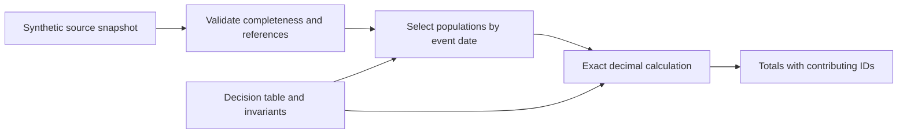

# Business metrics contracts

A small, runnable example of turning a business rule into a deterministic calculation and verifiable evidence.

An order is paid in July, shipped in August and refunded later. Which monthly totals should include it? This repository defines that question before implementing the answer. It also rejects incomplete sources instead of quietly reporting zero.

**All records are synthetic.** The implementation and the `DEMO-CASHFLOW/1.0.0` contract were created independently for this public example. They are not production accounting rules.

## Run it

Python 3.11 or later:

```sh
python -m venv .venv
# Windows: .venv\Scripts\activate
# macOS / Linux: source .venv/bin/activate
python -m pip install .
python -m unittest discover -s tests -v
python -m business_metrics fixtures/synthetic-orders.json --month 2026-07
```

The synthetic July snapshot produces:

| Population / measure | Expected result |
|---|---|
| Paid orders | A, B, D, E, F |
| Shipped orders | A, C |
| Executed refunds | R1 |
| Paid gross | EUR 260.00 |
| Shipped gross | EUR 180.00 |
| Refunds | EUR 20.00 |
| Net cash movement | EUR 240.00 |

The output includes the contract version, period, timezone and contributing IDs, so a reviewer can inspect the population behind a total. `cash_net` is paid gross minus executed refunds; it is not profit or recognized revenue.

## From need to evidence



- [Contract](docs/contract.md): definitions, preconditions and limits.
- [Decision table](fixtures/decision-table.json): twelve examples, including timezone boundaries and missing events.
- [Tests](tests/test_contract.py): duplicates, cumulative refunds, source completeness, invalid data, stable output and reconciliation across months.
- [Implementation](src/business_metrics/contract.py): no provider calls, database or paid dependencies.
- [Continuous checks](.github/workflows/checks.yml): installation, tests and the example command on Python 3.11 and 3.13.

## Design choices

**Money as decimal strings.** Binary floating point never enters the monetary calculation. A value with more than two decimal places is rejected rather than rounded silently.

**Independent event populations.** Payment, shipment and refund dates answer different questions. A later refund preserves the original payment event.

**Fail before publishing.** Duplicate IDs, unknown references, unsupported currencies and incomplete snapshots prevent a result. A known empty month is different from an unavailable source.

**Explicit scope.** The caller supplies the complete referenced history and declares completeness. The engine cannot prove a connector supplied every record. It is a batch demonstration with no persistence, API, access control, tax rules, currency conversion or partial shipment allocation.

For the broader engineering context, see [Jaber Bouchouit's portfolio](https://github.com/jaberbouchouit/engineering-portfolio).

## License

MIT, covering this independently written example only. No private application source or customer data is included.
